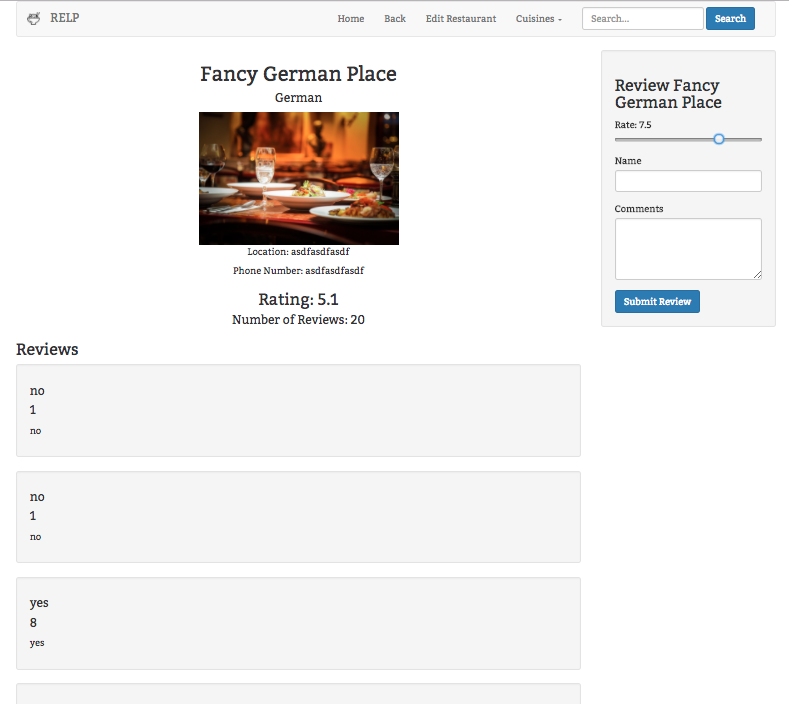

# _Relp Restaurant Reviewer_

#### _This is a restaurant reviewing application, September 22, 2016_

#### By _**Stephen Burden**_

## Setup/Installation Requirements
* _Clone the repository from the link below to your desktop_
* _Run Composer Install to include all dependencies_
* _Download and install a program named 'MAMP' on your system_
* _Open MAMP and select Start Servers OR on terminal enter the command: apachectl start_
* _To access the MySQL shell at Epicodus, open the bash terminal and run: mysql.server start followed by the command mysql -uroot -proot
* _To access the database admin page use your browser to open localhost:8080/phpmyadmin, or localhost:8888/phpmyadmin depending on your networks settings with the user:root and password:root_
* _In Terminal or Command Prompt go to the /web directory and enter the command: php -S localhost:8000_
* _To browse the website go to http://localhost:8000/ in the browser of your choosing_
* _If the server's database is not functioning: change the server number in the app file to match your MySQL Port number in MAMP (Preferences... -> Ports). EXAMPLE: 'mysql:host=localhost:8889;dbname=restaurants' OR uncomment out the 'ALTERNATIVE SERVER' in the app file and comment out the other._

## Link
https://github.com/spburden/restaurant-reviewer-php-sql

## Known Bugs
_There are no known bugs with this application._

## Support and contact details
_spburden@hotmail.com_

## Technologies Used
_PHP, MySQL, MAMP, Silex, Twig, PHP Unit, HTML, and Bootstrap_

### License
The MIT License (MIT)

Copyright (c) 2016 **_Stephen Burden_**
